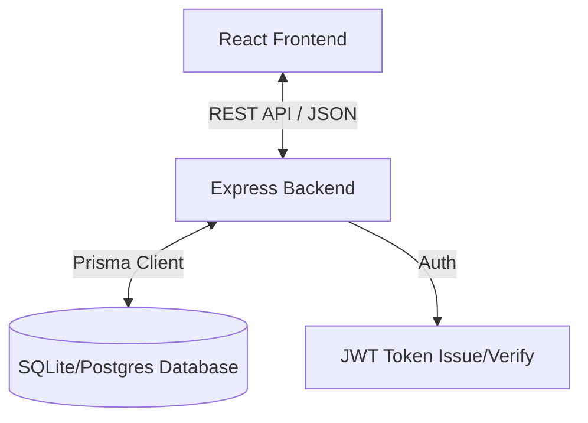

# GearGuard - Industrial Maintenance Management System


## 📋 Table of Contents

1. [Project Overview](#-project-overview)
2. [Key Features](#-key-features)
   - [Authentication & Security](#authentication--security)
   - [Dashboard & Analytics](#dashboard--analytics)
   - [Equipment Management](#equipment-management)
   - [Maintenance Requests](#maintenance-requests)
   - [Team Management](#team-management)
   - [Reporting Module](#reporting-module)
3. [Technology Stack](#-technology-stack)
   - [Frontend Architecture](#frontend-architecture)
   - [Backend Architecture](#backend-architecture)
   - [Database Design](#database-design)
4. [System Architecture](#-system-architecture)
5. [Prerequisites](#-prerequisites)
6. [Installation & Setup](#-installation--setup)
   - [Cloning the Repository](#1-cloning-the-repository)
   - [Backend Setup](#2-backend-setup)
   - [Frontend Setup](#3-frontend-setup)
   - [Database Initialization](#4-database-initialization)
7. [Environment Configuration](#-environment-configuration)
8. [Running the Application](#-running-the-application)
9. [API Documentation](#-api-documentation)
   - [Auth Endpoints](#auth-endpoints)
   - [Equipment Endpoints](#equipment-endpoints)
   - [Requests Endpoints](#requests-endpoints)
   - [Teams Endpoints](#teams-endpoints)
10. [Database Schema](#-database-schema)
11. [Project Structure](#-project-structure)
12. [Contributing](#-contributing)
13. [License](#-license)
14. [Contact & Support](#-contact--support)

---

## 🚀 Project Overview

**GearGuard** is a state-of-the-art **Industrial Maintenance Management System (IMMS)** designed to streamline the complex workflows of tracking machinery, scheduling maintenance, and managing technical teams in a manufacturing or industrial setting.

Built for the **Odoo Hackathon (Adani)**, this solution addresses the critical need for zero-downtime manufacturing by providing real-time visibility into equipment health, automating maintenance workflows, and ensuring that the right technicians are assigned to the right tasks at the right time.

GearGuard replaces legacy spreadsheet-based tracking with a modern, reactive, and beautiful web application that works seamlessly across desktop and tablet devices, empowering floor managers and technicians alike.

---

## ✨ Key Features

GearGuard is packed with enterprise-grade features designed for scalability and ease of use.

### Authentication & Security
- **Secure Login/Registration**: Role-based access control (RBAC) ensures users only see what they are supposed to see.
- **JWT Authentication**: Stateless, secure token-based authentication (JSON Web Tokens) for session management.
- **Password Encryption**: All passwords are hashed using **Bcrypt** before storage.
- **Role Management**: Distinguish between `ADMIN`, `MANAGER`, `TECHNICIAN`, and generic `USER` roles.

### Dashboard & Analytics
- **Real-Time Overview**: View critical KPIs such as "Open Requests", "Equipment Status", and "Team Availability" at a glance.
- **Visual Graphs**: Interactive charts showing maintenance trends over time.
- **Actionable Insights**: Highlights overdue maintenance and critical failures immediately upon login.

### Equipment Management
- **Centralized Asset Registry**: Maintain a digital twin of all physical assets (Machinery, Vehicles, HVAC, etc.).
- **Detailed Asset Profiles**: Store metadata like Serial Numbers, Purchase Dates, Warranty Expiry, and Location.
- **Status Tracking**: Monitor whether equipment is `OPERATIONAL`, `UNDER_MAINTENANCE`, `SCRAPPED`, or `DECOMMISSIONED`.
- **Category Filtering**: Easily filter assets by category (e.g., Electrical, Plumbing, IT).

### Maintenance Requests
- **Kanban Board View**: Drag-and-drop interface to manage request lifecycles (New -> In Progress -> Repaired).
- **Priority Handling**: Flag requests as `LOW`, `MEDIUM`, `HIGH`, or `CRITICAL`.
- **Corrective & Preventive**: Support for both breakdown repairs and scheduled maintenance.
- **Smart Assignment**: Automatically or manually assign requests to specialized teams or specific technicians.

### Team Management
- **Department Organization**: Create and manage specialized maintenance teams (e.g., "Electrical Repair Unit").
- **Member Roles**: Assign Team Leads and Members.
- **Workload Balancing**: View how many active requests strictly assigned per team.

### Reporting Module
- **Custom Reports**: Generate detailed reports on equipment downtime, team performance, and request volume.
- **Export Functionality**: Ability to export data for external analysis (CSV/PDF support planned).
- **Search & Filter**: Powerful search capabilities to dig into historical data.

---

## 🛠 Technology Stack

We chose a modern, type-safe stack to ensure reliability and developer velocity.

### Frontend Architecture
- **Framework**: [React](https://react.dev/) (v18) with [Vite](https://vitejs.dev/) for lightning-fast HMR and builds.
- **Language**: [TypeScript](https://www.typescriptlang.org/) for strict type safety and cleaner code.
- **Styling**: [Tailwind CSS](https://tailwindcss.com/) for utility-first, responsive design.
- **Animations**: [Framer Motion](https://www.framer.com/motion/) for smooth, engaging UI transitions.
- **Icons**: [Lucide React](https://lucide.dev/) for consistent, modern iconography.
- **Routing**: [React Router DOM](https://reactrouter.com/) for declarative client-side routing.
- **State Management**: React Context API & Hooks.

### Backend Architecture
- **Runtime**: [Node.js](https://nodejs.org/) (LTS) & [Express.js](https://expressjs.com/) for a robust REST API.
- **Language**: TypeScript for shared types with the frontend and backend safety.
- **Validation**: [Zod](https://zod.dev/) for rigorous runtime request validation.
- **Security**: `cors`, `helmet` (recommended), `bcrypt`, `jsonwebtoken`.

### Database Design
- **ORM**: [Prisma](https://www.prisma.io/) for intuitive data modeling and type-safe database queries.
- **Database Engine**: **SQLite** (configured for easy local dev) / **PostgreSQL** (production ready).
- **Schema Management**: Automated migrations via Prisma Migrate.

---

## 🏗 System Architecture

The application follows a standard **Client-Server** architecture:

1.  **Client (Frontend)**: Runs in the user's browser. Makes HTTP calls (`fetch`/`axios`) to the backend API.
2.  **Server (Backend)**: Exposes a RESTful API at `/api`. Handles business logic, auth, and database interactions.
3.  **Database**: Stores all persistent data. Managed via Prisma Client.



---

## ✅ Prerequisites

Before running the project, ensure you have the following installed on your machine:

1.  **Node.js**: Version 18.x or higher. [Download Here](https://nodejs.org/)
2.  **npm** or **yarn**: Package manager (comes with Node.js).
3.  **Git**: For version control.
4.  **VS Code** (Optional): Recommended editor with ESLint and Prettier extensions.

---

## 📦 Installation & Setup

Follow these steps to get GearGuard running on your local machine.

### 1. Cloning the Repository

```bash
git clone https://github.com/KunjShah95/odoo-hackathon-adani.git
cd odoo-hackathon-adani
```

### 2. Backend Setup

The backend handles the API and database integration.

```bash
# Navigate to backend directory
cd backend

# Install dependencies
npm install

# Initialize Environment Variables
cp .env.example .env
# Open .env and verify the configuration (see Environment Configuration section)

# Run Database Migrations (creates the SQLite file)
npx prisma migrate dev --name init

# (Optional) Seed the database with dummy data
npm run prisma:seed
```

### 3. Frontend Setup

The frontend delivers the user interface.

```bash
# Open a new terminal tab/window
cd frontend

# Install dependencies
npm install

# Start the development server
npm run dev
```

### 4. Verification

- Backend should be running on `http://localhost:5000` (or your configured port).
- Frontend should be running on `http://localhost:5173`.
- Open your browser to `http://localhost:5173` to see the application.

---

## 🔧 Environment Configuration

You need to configure the `.env` file in the `backend` directory.

### Backend `.env`

```ini
# Server Configuration
PORT=5000
NODE_ENV=development

# Database Configuration (Defaults to local SQLite file)
DATABASE_URL="file:./dev.db"

# Authentication Secrets
# WARNING: Change this in production!
JWT_SECRET="gearguard-secret-key-CHANGE-THIS-IN-PROD"

# Usage Settings
ALLOWED_ORIGINS="http://localhost:5173"
```

---

## 🏃 Running the Application

### Development Mode

To run both servers in development mode (with "hot reload"):

**Backend Terminal:**
```bash
npm run dev
```
*Uses `nodemon` to restart on file changes.*

**Frontend Terminal:**
```bash
npm run dev
```
*Uses Vite to HMR changes instantly.*

### Production Build

To act like a production environment:

1.  **Build Backend:**
    ```bash
    cd backend
    npm run build
    npm start
    ```

2.  **Build Frontend:**
    ```bash
    cd frontend
    npm run build
    npx vite preview
    ```

---

## 📡 API Documentation

The backend exposes the following RESTful endpoints. All protected routes require a valid `Authorization: Bearer <token>` header.

### Auth Endpoints
| Method | Endpoint | Description | Auth Required |
| :--- | :--- | :--- | :--- |
| `POST` | `/api/auth/register` | Register a new user account | No |
| `POST` | `/api/auth/login` | Log in and receive JWT token | No |
| `GET` | `/api/auth/me` | Get current user's profile | Yes |

### Equipment Endpoints
| Method | Endpoint | Description | Auth Required |
| :--- | :--- | :--- | :--- |
| `GET` | `/api/equipment` | List all equipment | Yes |
| `POST` | `/api/equipment` | Create new equipment | Yes (Mgr/Admin) |
| `GET` | `/api/equipment/:id` | Get single equipment details | Yes |
| `PUT` | `/api/equipment/:id` | Update equipment details | Yes (Mgr/Admin) |
| `DELETE` | `/api/equipment/:id` | Delete equipment | Yes (Admin) |

### Requests Endpoints
| Method | Endpoint | Description | Auth Required |
| :--- | :--- | :--- | :--- |
| `GET` | `/api/requests` | List all maintenance requests | Yes |
| `POST` | `/api/requests` | Create a new request | Yes |
| `PUT` | `/api/requests/:id/status` | Update request status (e.g. to DONE) | Yes |
| `PUT` | `/api/requests/:id/assign` | Assign request to a user/team | Yes |
| `GET` | `/api/requests/stats` | Get KPI stats for dashboard | Yes |

### Teams Endpoints
| Method | Endpoint | Description | Auth Required |
| :--- | :--- | :--- | :--- |
| `GET` | `/api/teams` | List maintenance teams | Yes |
| `POST` | `/api/teams` | Create a new team | Yes (Admin) |
| `POST` | `/api/teams/:id/members` | Add member to team | Yes (Admin) |

---

## 🗄 Database Schema

The data model is defined in `prisma/schema.prisma`. Key models include:

### `User`
Represents system users (Admins, Managers, Technicians).
- `id`: Unique CUID.
- `role`: Role based access (ADMIN, MANAGER, etc).
- `teamMemberships`: Link to Maintenance Teams.

### `Equipment`
Represents physical assets.
- `status`: Operational status enum.
- `category`: Classification of equipment.
- `maintenanceTeam`: The team creating default responsibility for this asset.

### `MaintenanceRequest`
The core work order.
- `priority`: Urgency level.
- `status`: Workflow state (NEW -> IN_PROGRESS -> REPAIRED).
- `logs`: Audit trail of work done (Duration, completion date).

### `MaintenanceTeam`
Groups of users.
- `specialization`: E.g., "High Voltage", "Hydraulics".

---

## 📂 Project Structure

```text
odoo-hackathon-adani/
├── backend/                # Backend Server Code
│   ├── src/
│   │   ├── config/         # Env usage and formatting
│   │   ├── controllers/    # API Request Handlers
│   │   ├── middleware/     # Auth & Error handling
│   │   ├── routes/         # Express Route Definitions
│   │   ├── services/       # Business Logic Layer
│   │   └── types/          # Shared TypeScript Interfaces
│   ├── prisma/
│   │   ├── schema.prisma   # Database Model Definitions
│   │   └── seed.ts         # Dummy Data Population
│   └── package.json
│
├── frontend/               # Frontend Application Code
│   ├── src/
│   │   ├── components/     # Reusable UI Components (Cards, Buttons)
│   │   ├── layouts/        # Page Layout Wrappers
│   │   ├── pages/          # Full Page Views (Login, Dashboard)
│   │   ├── types/          # TypeScript Definitions
│   │   └── App.tsx         # Root Component & Routing
│   ├── public/             # Static Assets
│   └── tailwind.config.js  # Styling Configuration
```

---

## 👥 Contributing

We welcome contributions to GearGuard!

1.  **Fork** the repository.
2.  **Create a branch** for your feature: `git checkout -b feature/amazing-feature`.
3.  **Commit** your changes: `git commit -m 'Add some amazing feature'`.
4.  **Push** to the branch: `git push origin feature/amazing-feature`.
5.  **Open a Pull Request**.

Please ensure your code follows the existing style, uses TypeScript, and that all linting checks pass.

---

## 📄 License

This project is licensed under the **MIT License**. See the [LICENSE](LICENSE) file for details.

---

## 📞 Contact & Support

**Team/Developer Logic**  
Project maintained by **KunjShah95** for the Odoo Hackathon.

If you encounter issues, please check the [GitHub Issues](https://github.com/KunjShah95/odoo-hackathon-adani/issues) page or contact the team directly via the hackathon portal.

Happy Coding! 🚀
