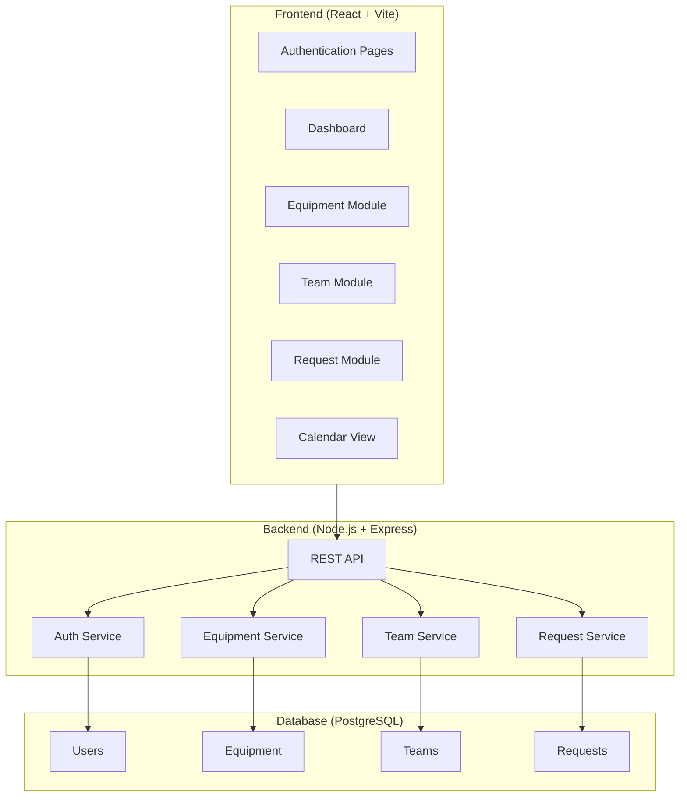

# GearGuard: Complete System Architecture & Implementation Plan

A comprehensive maintenance management system for tracking equipment, managing teams, and handling maintenance requests.

---

## User Review Required

> [!IMPORTANT]
> **Tech Stack Confirmation Needed**
> - **Frontend**: React + Vite + TypeScript + Tailwind CSS
> - **Backend**: Node.js + Express + TypeScript
> - **Database**: PostgreSQL with Prisma ORM
> - **Authentication**: JWT + bcrypt (or Firebase Auth if preferred)
> 
> Please confirm this tech stack or suggest alternatives.

> [!WARNING]
> **Deployment Strategy**
> - Should the frontend and backend be deployed separately?
> - Do you have a preferred hosting platform (Vercel, Railway, etc.)?

---

## System Architecture Overview



---

## Proposed Changes

### Database Layer (Prisma Schema)

#### [NEW] [schema.prisma](file:///c:/odoo%20hackathon%20adani/backend/prisma/schema.prisma)

Complete database schema with the following models:

```prisma
// User & Authentication
model User {
  id            String   @id @default(cuid())
  email         String   @unique
  password      String
  name          String
  role          Role     @default(TECHNICIAN)
  department    String?
  createdAt     DateTime @default(now())
  updatedAt     DateTime @updatedAt
  
  // Relations
  teamMemberships  TeamMember[]
  assignedEquipment Equipment[]
  createdRequests   MaintenanceRequest[] @relation("CreatedBy")
  assignedRequests  MaintenanceRequest[] @relation("AssignedTo")
}

enum Role {
  ADMIN
  MANAGER
  TECHNICIAN
  USER
}

// Equipment Module
model Equipment {
  id                String   @id @default(cuid())
  name              String
  serialNumber      String   @unique
  category          Category
  department        String
  location          String
  purchaseDate      DateTime
  warrantyExpiry    DateTime?
  status            EquipmentStatus @default(OPERATIONAL)
  
  // Relations
  assignedToId      String?
  assignedTo        User?    @relation(fields: [assignedToId], references: [id])
  maintenanceTeamId String?
  maintenanceTeam   MaintenanceTeam? @relation(fields: [maintenanceTeamId], references: [id])
  requests          MaintenanceRequest[]
  
  createdAt         DateTime @default(now())
  updatedAt         DateTime @updatedAt
}

enum Category {
  MACHINERY
  VEHICLE
  IT_EQUIPMENT
  ELECTRICAL
  HVAC
  PLUMBING
  OTHER
}

enum EquipmentStatus {
  OPERATIONAL
  UNDER_MAINTENANCE
  SCRAPPED
  DECOMMISSIONED
}

// Maintenance Team Module
model MaintenanceTeam {
  id          String   @id @default(cuid())
  name        String
  specialization String
  description String?
  
  // Relations
  members     TeamMember[]
  equipment   Equipment[]
  requests    MaintenanceRequest[]
  
  createdAt   DateTime @default(now())
  updatedAt   DateTime @updatedAt
}

model TeamMember {
  id        String   @id @default(cuid())
  userId    String
  teamId    String
  role      TeamRole @default(MEMBER)
  
  user      User @relation(fields: [userId], references: [id])
  team      MaintenanceTeam @relation(fields: [teamId], references: [id])
  
  @@unique([userId, teamId])
}

enum TeamRole {
  LEAD
  MEMBER
}

// Maintenance Request Module
model MaintenanceRequest {
  id              String   @id @default(cuid())
  subject         String
  description     String
  type            RequestType
  priority        Priority @default(MEDIUM)
  status          RequestStatus @default(NEW)
  
  scheduledDate   DateTime?
  completedDate   DateTime?
  duration        Float?   // Hours spent
  
  // Relations
  equipmentId     String
  equipment       Equipment @relation(fields: [equipmentId], references: [id])
  teamId          String?
  team            MaintenanceTeam? @relation(fields: [teamId], references: [id])
  createdById     String
  createdBy       User @relation("CreatedBy", fields: [createdById], references: [id])
  assignedToId    String?
  assignedTo      User? @relation("AssignedTo", fields: [assignedToId], references: [id])
  
  createdAt       DateTime @default(now())
  updatedAt       DateTime @updatedAt
}

enum RequestType {
  CORRECTIVE
  PREVENTIVE
}

enum Priority {
  LOW
  MEDIUM
  HIGH
  CRITICAL
}

enum RequestStatus {
  NEW
  IN_PROGRESS
  REPAIRED
  SCRAP
}
```

---

## Backend Structure

#### [NEW] Backend folder structure

```
backend/
├── prisma/
│   └── schema.prisma
├── src/
│   ├── index.ts                    # Entry point
│   ├── app.ts                      # Express app setup
│   ├── config/
│   │   ├── database.ts             # Prisma client
│   │   └── env.ts                  # Environment config
│   ├── middleware/
│   │   ├── auth.ts                 # JWT authentication
│   │   ├── validation.ts           # Request validation
│   │   └── errorHandler.ts         # Global error handler
│   ├── routes/
│   │   ├── index.ts                # Route aggregator
│   │   ├── auth.routes.ts          # /api/auth
│   │   ├── equipment.routes.ts     # /api/equipment
│   │   ├── teams.routes.ts         # /api/teams
│   │   └── requests.routes.ts      # /api/requests
│   ├── controllers/
│   │   ├── auth.controller.ts
│   │   ├── equipment.controller.ts
│   │   ├── teams.controller.ts
│   │   └── requests.controller.ts
│   ├── services/
│   │   ├── auth.service.ts
│   │   ├── equipment.service.ts
│   │   ├── teams.service.ts
│   │   └── requests.service.ts
│   └── types/
│       └── index.ts                # TypeScript types
├── package.json
├── tsconfig.json
└── .env.example
```

#### API Endpoints

| Method | Endpoint | Description |
|--------|----------|-------------|
| **Authentication** |||
| POST | `/api/auth/register` | Register new user |
| POST | `/api/auth/login` | User login |
| POST | `/api/auth/logout` | User logout |
| GET | `/api/auth/me` | Get current user |
| **Equipment** |||
| GET | `/api/equipment` | List all equipment |
| POST | `/api/equipment` | Create equipment |
| GET | `/api/equipment/:id` | Get equipment details |
| PATCH | `/api/equipment/:id` | Update equipment |
| DELETE | `/api/equipment/:id` | Delete equipment |
| GET | `/api/equipment/:id/requests` | Get equipment's requests |
| **Teams** |||
| GET | `/api/teams` | List all teams |
| POST | `/api/teams` | Create team |
| GET | `/api/teams/:id` | Get team details |
| PATCH | `/api/teams/:id` | Update team |
| DELETE | `/api/teams/:id` | Delete team |
| POST | `/api/teams/:id/members` | Add member to team |
| DELETE | `/api/teams/:id/members/:userId` | Remove member |
| **Requests** |||
| GET | `/api/requests` | List all requests |
| POST | `/api/requests` | Create request |
| GET | `/api/requests/:id` | Get request details |
| PATCH | `/api/requests/:id` | Update request |
| PATCH | `/api/requests/:id/status` | Update request status |
| GET | `/api/requests/calendar` | Get calendar view data |
| GET | `/api/requests/kanban` | Get kanban board data |

---

## Frontend Structure

#### [NEW] Frontend folder structure

```
frontend/
├── public/
│   └── favicon.ico
├── src/
│   ├── main.tsx                    # Entry point
│   ├── App.tsx                     # Root component
│   ├── index.css                   # Global styles
│   ├── api/
│   │   ├── client.ts               # Axios instance
│   │   ├── auth.ts                 # Auth API calls
│   │   ├── equipment.ts            # Equipment API
│   │   ├── teams.ts                # Teams API
│   │   └── requests.ts             # Requests API
│   ├── components/
│   │   ├── ui/                     # Reusable UI components
│   │   ├── layout/
│   │   ├── equipment/
│   │   ├── teams/
│   │   └── requests/
│   ├── pages/
│   ├── context/
│   ├── hooks/
│   ├── types/
│   └── utils/
├── package.json
├── vite.config.ts
├── tailwind.config.js
└── tsconfig.json
```

---

## UI/UX Design Specifications

#### Color Palette
```css
:root {
  --primary: #2563eb;        /* Blue */
  --primary-dark: #1d4ed8;
  --secondary: #64748b;      /* Slate */
  --success: #22c55e;        /* Green */
  --warning: #f59e0b;        /* Amber */
  --danger: #ef4444;         /* Red */
  --background: #0f172a;     /* Dark slate */
  --surface: #1e293b;        /* Lighter slate */
  --border: #334155;
  --text-primary: #f8fafc;
  --text-secondary: #94a3b8;
}
```

---

## Verification Plan

### Automated Tests
1. **Backend API Tests** (using Jest + Supertest)
2. **Frontend Component Tests** (using Vitest + React Testing Library)

### Manual Verification
1. **Authentication Flow**
2. **Equipment CRUD**
3. **Maintenance Request Workflow**
4. **Calendar View**
5. **Responsive Design**

---

## Implementation Order

1. **Phase 1**: Database Schema + Backend Setup
2. **Phase 2**: Authentication System
3. **Phase 3**: Equipment Module (Backend + Frontend)
4. **Phase 4**: Teams Module (Backend + Frontend)
5. **Phase 5**: Requests Module with Kanban
6. **Phase 6**: Calendar View + Reports
7. **Phase 7**: Integration Testing + Polish
